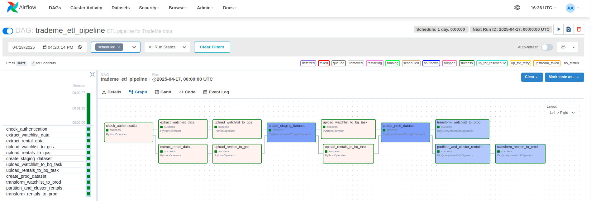
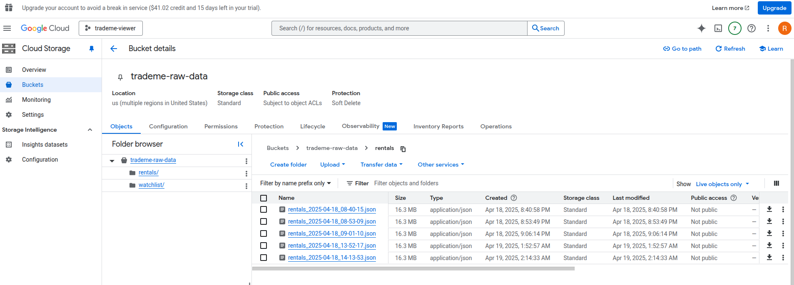
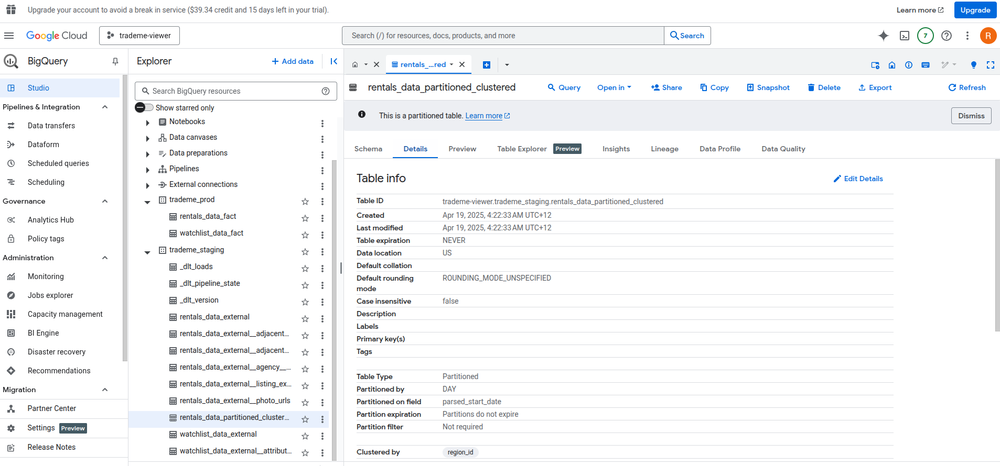
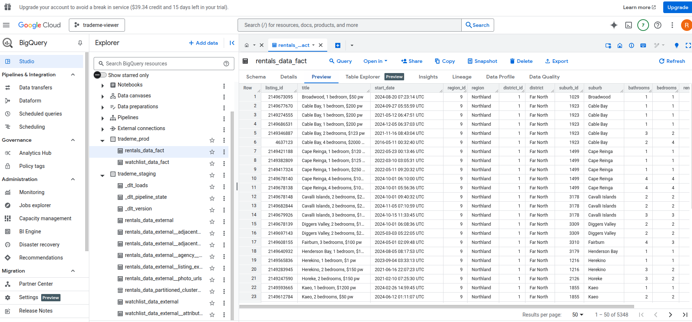
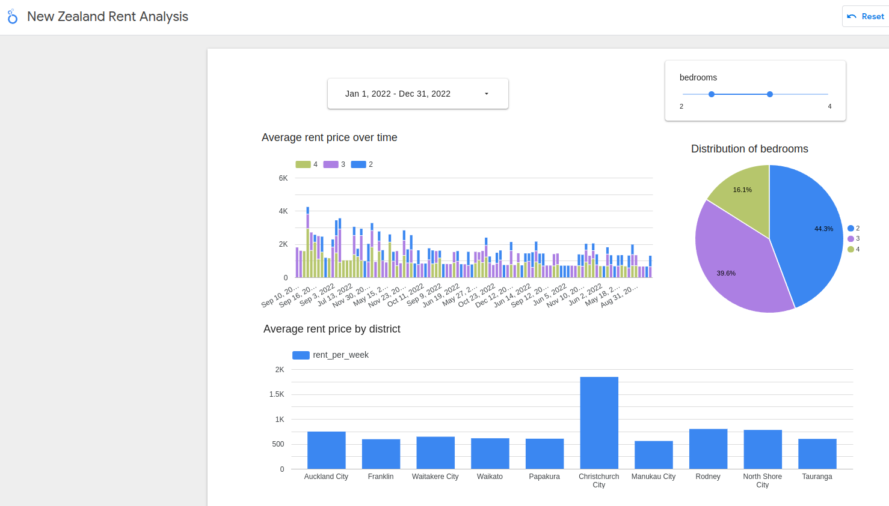

# TradeMe Rent Analytics


## Background

TradeMe is the largest online marketplace and classified advertising platform in New Zealand. It's similar to eBay, allowing users to buy and sell items, as well as list and find properties for rent or sale, jobs, and services.

For many New Zealanders, especially those moving to a new city or looking for their first home, TradeMe is the go-to platform for finding rental properties. However, the rental market in New Zealand, particularly in major cities like Auckland and Wellington, can be competitive and expensive.

## Project Goal

The goal of this project is to build a data pipeline that extracts rental property listings from TradeMe, transforms the data, and loads it into a data warehouse for analysis. This will allow users to gain insights into the rental market, such as:

- Average rent prices by location, property type, and number of bedrooms
- Trends in rent prices over time
- Areas with the highest and lowest rent prices
- Correlation between rent prices and property features (e.g., number of bedrooms, bathrooms, parking spaces)

## Architecture

The TradeMe Rent Analytics project uses a modern data engineering architecture with the following components:

1. **Data Source**: TradeMe API provides rental property listings and watchlist data.
2. **Data Orchestration**: Apache Airflow manages the ETL workflow.
3. **Data Lake**: Google Cloud Storage stores the raw JSON data.
4. **Data Warehouse**: Google BigQuery stores the processed data for analysis.
5. **Infrastructure**: Terraform provisions and manages the cloud resources.
6. **Containerization**: Docker ensures consistent environments across development and production.

## Data Pipeline

The data pipeline consists of the following steps:



1. **Extract**: Data is extracted from the TradeMe API using OAuth authentication.
   - Rental property listings across all New Zealand
   - User's watchlist items (saved properties)

2. **Load to Data Lake**: Raw JSON data is uploaded to Google Cloud Storage.
   - Organized in separate folders for rentals and watchlist data
   - Files are timestamped for versioning



3. **Transform and Load to Staging**: Data is loaded into BigQuery staging tables.
   - External tables are created to read the JSON data
   - Date fields are parsed and formatted
  


4. **Transform to Production**: Data is transformed and loaded into production fact tables.
   - Data is partitioned and clustered for efficient querying
   - Fact tables are created for rental properties and watchlist items



5. **Analysis**: The data in BigQuery can be analyzed using SQL or connected to visualization tools.

## Dashboard

The final output of the pipeline is a dashboard that provides insights into the rental market.

You can access the live dashboard here: [TradeMe Rent Analytics Dashboard](https://lookerstudio.google.com/u/0/reporting/b054073d-8b9a-4e71-b28f-b0cc8c82e7c6/page/GSTHF?s=sXIuQyD5Asw)



The dashboard includes visualizations such as:
- Distribution of bedrooms
- Average rent price over time
- Average rent price by district

## Project Structure

```
TradeMe/
├── .gitignore                      # Git ignore file
├── docker-compose.yaml             # Docker Compose configuration
├── Dockerfile                      # Custom Airflow image definition
├── load_gcp_secrets.py             # Script to load secrets from GCP Secret Manager
├── README.md                       # Project documentation
├── airflow/                        # Airflow configuration
│   ├── dags/                       # Airflow DAGs
│   │   ├── trademe_dag.py          # Main ETL pipeline DAG
│   │   └── scripts/                # Python scripts used by DAGs
│   │       ├── __init__.py         # Package initialization
│   │       └── oauth_api.py        # TradeMe OAuth API client
│   ├── keys/                       # Directory for API keys and credentials
│   ├── logs/                       # Airflow logs
│   └── plugins/                    # Airflow plugins
├── images/                         # Images for documentation
│   ├── Airflow.png                 # Airflow DAG visualization
│   ├── BigQuery.png                # BigQuery schema visualization
│   ├── Dashboard.png               # Dashboard visualization
│   ├── DataLake.png                # Data lake architecture diagram
│   ├── FactTable.png               # Fact table schema visualization
│   └── ForRent.jpg                 # Project banner image
└── terraform/                      # Terraform IaC configuration
    ├── main.tf                     # Main Terraform configuration
    └── startup_script.sh           # VM startup script
```

## Technologies Used

- **Apache Airflow**: Workflow orchestration
- **Google Cloud Platform**:
  - **Google Cloud Storage**: Data lake for raw data
  - **BigQuery**: Data warehouse for analytics
  - **Compute Engine**: VM for running the pipeline
  - **Secret Manager**: Secure storage for credentials
- **Python**: Programming language for data processing
- **OAuth**: Authentication for TradeMe API
- **Docker**: Containerization for consistent environments
- **Terraform**: Infrastructure as Code for GCP resources
- **Data Load Tool (DLT)**: Python library for data loading

## Setup and Installation

### Prerequisites

- Google Cloud Platform account
- TradeMe API credentials
- Docker and Docker Compose
- Python 3.8+

### Local Development Setup

1. Clone the repository:
   ```bash
   git clone https://github.com/romanaumov/TradeMe.git
   cd TradeMe
   ```

2. Set up environment variables:

   - Create OAuth credentials on the TradeMe platform (register an app and get secret tokens from TradeMe)
   - Create service account key in the Google Cloud
   - Create secret variables in Google Secret Manager .env, service account key, TradeMe access credentials.

3. Access the Airflow UI at http://<VM_EXTERNAL_IP>:8080 (default username/password: airflow/airflow)

### Cloud Deployment

1. Set up Terraform variables:
   ```bash
   cd terraform
   # Create a terraform.tfvars file with your GCP project details
   ```

2. Deploy the infrastructure:
   ```bash
   terraform init
   terraform apply
   ```

3. The startup script will automatically perform the following steps in Cloud VM:
   - Install Docker and Docker Compose
   - Clone the repository
   - Load secrets from GCP Secret Manager
   - Start the Docker containers

## Data Model

The project uses a simple star schema in BigQuery with two main fact tables:

1. **rentals_data_fact**: Contains information about rental properties
   - listing_id (Primary Key)
   - title
   - start_date (Partitioned)
   - region_id (Clustered)
   - region
   - district_id
   - district
   - suburb_id
   - suburb
   - bathrooms
   - bedrooms
   - rent_per_week
   - pets_okay
   
   The rentals table is partitioned by start_date and clustered by region_id to optimize query performance. Partitioning by date allows for efficient filtering of rental listings by time periods (e.g., weekly or monthly analysis), significantly reducing the amount of data scanned for time-based queries. Clustering by region_id ensures that data for the same region is stored together, which improves performance for regional analysis and comparisons, as these are common analytical patterns for rental market analysis.

2. **watchlist_data_fact**: Contains information about saved properties
   - listing_id (Primary Key)
   - title
   - start_date
   - end_date
   - as_at
   - price_display
   - bedrooms
   - region_id
   - region
   - suburb

## Future Enhancements

- Add more data sources (e.g., property sales, historical data)
- Implement machine learning models for price prediction
- Create a web application for interactive analysis
- Add real-time data processing for immediate insights
- Expand to other regions in New Zealand


## Project Evaluation Criteria

Based on the DE Zoomcamp Project Evaluation Criteria:

* Problem description
* 
    [x] 4 points: Problem is well described and it's clear what the problem the project solves

* Cloud
* 
    [x] 4 points: The project is developed in the cloud and IaC tools are used
  
* Data ingestion (Batch / Workflow orchestration)
* 
    [x] 4 points: End-to-end pipeline: multiple steps in the DAG, uploading data to data lake

* Data warehouse
* 
    [x] 4 points: Tables are partitioned and clustered in a way that makes sense for the upstream queries (with explanation)

* Transformations
* 
    [x] 2 points: Simple SQL transformation (no dbt or similar tools)

* Dashboard
* 
    [x] 4 points: A dashboard with 2 tiles

* Reproducibility
* 
    [x] 4 points: Instructions are clear, it's easy to run the code, and the code works
